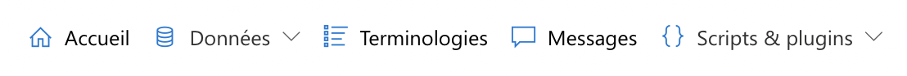

### <i class="fa fa-check" style="color: steelblue;"></i> Menu principal

Cette partie comprend les liens vers les **pages principales** de l'application, qui sont :

- **Accueil** : __
- **Données** : __

### <i class="fa fa-check" style="color: steelblue;"></i> Menu secondaire