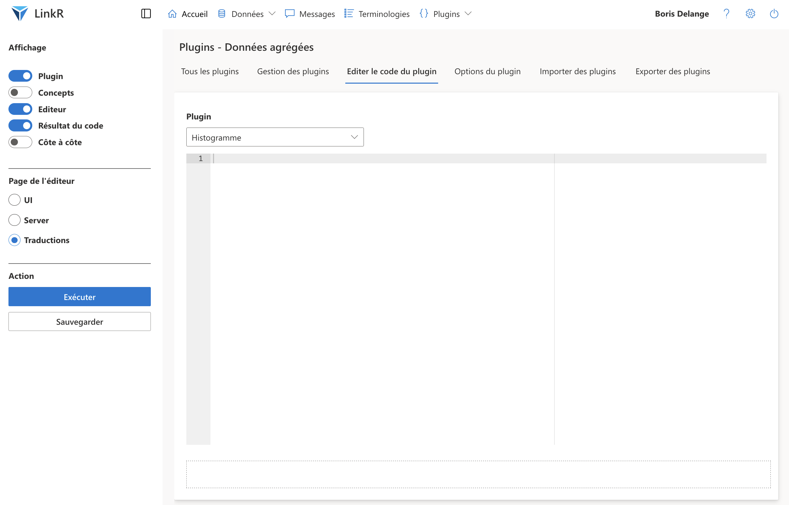
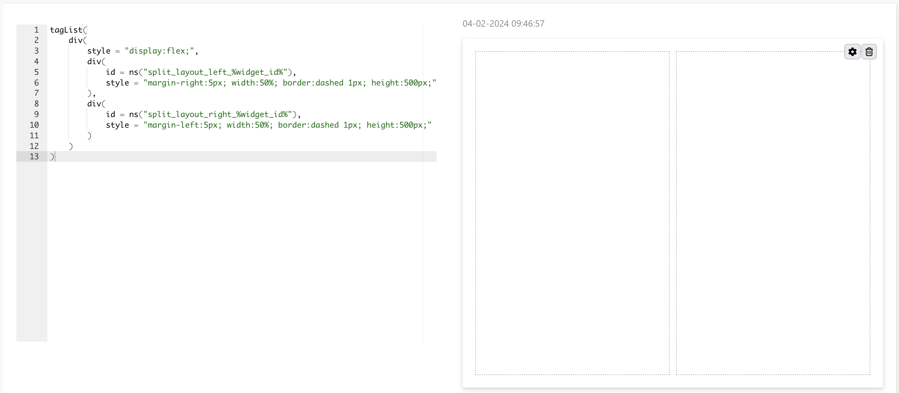

Auteur : Boris Delange 
Dernière modification : 04/02/2023

<h3><i class="fa fa-info-circle" style="color:steelblue;"></i> Introduction</h3>

Ce tutoriel a pour but de vous apprendre à **créer un plugin** dans LinkR.

Nous commencerons par définir **ce qu'est un plugin**.

Nous **détaillerons** le plugin que nous voulons **développer**.

Nous commencerons par créer l'**interface utilisateur**. Cette interface sera ensuite rendue fonctionnelle grâce au développement de la **logique serveur**.

Nous remplirons le fichier de **traductions**, ce qui facilitera le **partage** de notre plugin.

Après avoir **testé** notre plugin, nous le mettrons à disposition sur notre **dépôt git**.

**Plan** :

- Qu'est-ce qu'un plugin ?
- Spécifications du plugin
- Creation du plugin
- UI - Interface utilisateur / frontend
- Serveur - backend
- Traductions
- Tester le plugin
- Partager le plugin

 

<h2 style = "text-align:center;">
  
Qu'est-ce qu'un plugin ?

</h2>

<h3><i class="fa fa-question-circle" style="color:steelblue;"></i> Qu'est-ce qu'un plugin ?</h3>

Un plugin est un **script** composé de code écrit avec la librairie **Shiny** en R, permettant d'**ajouter des fonctionnalités** à l'application.

Par exemple, le plugin 'Séries temporelles {dygraphs}' présenté ci-dessous permettra aux utilisateurs d'afficher les données de leurs patients sous forme de **séries temporelles**, à l'aide de la librairie R <a href="https://rstudio.github.io/dygraphs/" target="_blank">{dygraphs}</a>.

Un plugin est composé de **trois parties** :

- **Interface utilisateur** (user interface - UI) : il s'agit du *front-end*, vous développerez ici l'interface graphique à laquelle l'utilisateur aura accès
- **Server** : il s'agit du *backend*, vous développerez ici la logique côté serveur du plugin : la manipulation des données etc
- **Traductions** : il s'agit d'un fichier CSV qui comprendra les traductions de l'interface utilisateur

Passons maintenant aux **spécifications** de notre plugin.

 

<h2 style = "text-align:center;">
  
Création du plugin

</h2>

<h3><i class="fa fa-list-ul" style="color:steelblue;"></i> Spécifications du plugin</h3>

J'aimerais créer une **interface graphique** qui me permette de **visualiser** la **distribution d'une variable**, sous forme d'un **histogramme**.

Il n'y a plus qu'à **rendre cela possible** en créant un plugin !

Je dois faire un premier **choix** : s'agit-il d'un plugin de données individuelles (patient par patient) ou agrégées (sur un groupe de patients) ?

Il est plus fréquent de vouloir visualiser la distribution d'une variable sur un groupe de patients plutôt que sur un patient seul, nous allons donc créer un **plugin de données agrégées**.

Ensuite, à quoi devra ressembler mon **interface graphique** ?

J'aimerais bien séparer l'écran en deux, à gauche on visualiserait mon **histogramme**, et à droite on pourrait régler les paramètres de ma figure, avec un menu déroulant pour **choisir la variable** et un champ pour choisir le **nombre de barres** sur mon histogramme.

**Côté serveur** maintenant.

Un histogramme n'est pas adapté pour visualiser tout type de données : je pourrai visualiser la distribution de données numériques, et de données catégorielles à condition que le nombre de catégories ne soit pas trop important.

Pour simplifier, je ne vais autoriser l'**affichage que des données numériques**. Je vais donc restreindre l'affichage à la variable *d$measurement*.

Pour rappel, le modèle de données utilisé par LinkR est le modèle **<a href = "https://ohdsi.github.io/CommonDataModel/" target = "_blank">OMOP</a>**. Consultez <a href = "https://ohdsi.github.io/CommonDataModel/cdm60.html#MEASUREMENT">cette page</a> pour en savoir plus sur la table measurement. Il s'agit de la table qui comprend les données de **laboratoires** et les **constantes physiologiques**.

Lorsque je vais changer la variable du **nombre de barres** de mon histogramme, les **modifications** devront être prises en compte **après validation**, pour ne pas réaliser de calculs inutiles. Je devrai également donner des bornes de valeurs possibles.

Résumons donc les **spécifications** de notre plugin :

- **Côté UI**
  - Visualisation de l'histogramme à gauche de l'écran
  - Paramètres à droite de l'écran
    - Variable à afficher
    - Nombre de barres composant l'histogramme, avec des bornes inférieure et supérieure
    - Validation des modifications
- **Côté serveur**
  - N'autoriser que les données de la variable *d$measurement*
  - Modifier le nombre de barres de l'histogramme en fonction de la valeur renseignée
  - Lancer le code du plot une fois le bouton de validation cliqué

Nous voilà prêts pour **aller coder tout ça** !

<h3><i class="fa fa-cogs" style="color:steelblue;"></i> Création du plugin</h3>

Rendez-vous sur la page *Plugins > Données individuelles* puis sur l'onglet *Gestion des plugins*.

Appelez-le 'Histogramme' par exemple.

Une fois le plugin créé, vous devriez le voir apparaître dans le tableau au milieu de la page.

Sur la ligne correspondant à votre nouveau plugin, cliquez sur l’icône de rouages afin d’**accéder aux options** de votre plugin.

Pour **en savoir plus sur les options**, cliquez sur le point d’interrogation en haut à droite de la page, puis sur *Options du plugin*.

Nous allons maintenant pouvoir <strong>éditer le code</strong> de notre plugin. Rendez-vous pour cela dans l'onglet *Editer le code*. 

L'éditeur auquel vous avez accès fonctionne comme une <strong>console R</strong>, exécutez le code en cliquant sur <em>Exécuter</em> ou en utilisant les raccourcis :
<ul>
<li>CMD/CTRL + SHIFT + ENTER : exécute l'ensemble du code</li>
<li>CMD/CTRL + ENTER : exécute le code sélectionné</li>
<li>CMD/CTRL + SHIFT + C : commente le code sélectionné</li>
</ul> 
Pensez à sauvegarder votre code. Vous pouvez également utiliser le raccourci CMD/CTRL + S.
  
  

Dans la rubrique **affichage** du menu de gauche, vous pouvez choisir d'**afficher** ou de **masquer** les éléments de la page, tels que le menu déroulant des concepts avec le toggle 'Concepts'.

Cliquez sur l'icône à côté de LinkR pour afficher ou masquer la barre latérale.

Commençons avec le fichier de **traductions**. Pour cela, cliquez sur la page 'Traductions' dans la rubrique **Page de l'éditeur** du menu de gauche.

<h3><i class="fa fa-language" style="color:steelblue;"></i> Traductions</h3>

Le fichier des traduction est un **fichier CSV**.

Il comportera une colonne *base*, qui sera le mot que vous intégrerez dans votre code de l'interface utilisateur.

Vous pouvez ensuite rajouter **une colonne par langage**, *en* pour l'anglais, *fr* pour le français. Ce format permettra d'ajouter à termes d'autres traductions.

Voici un exemple.

<pre class = "pre_tutorials"><code class = "r" style = "font-size:12px;">base,en,fr
plot,Plot,Figure
parameters,Parameters,Paramètres
execute,Execute code, Exécuter le code
long_sentence,"This a long sentence, with a comma","Ceci est une longue phrase, avec une virgule"
</code></pre>

Ainsi, si j'utilise `i18np$t("execute")` dans mon UI, ce code sera remplacé par 'Execute code' si LinkR est paramétré en anglais, 'Exécuter le code' si paramétré en français.

Cette fonction provient de la librairie [shiny.fluent](https://appsilon.github.io/shiny.i18n/articles/basics.html). Nous utilisons `i18np` plutôt que `i18n`, tout simplement parce que `i18n` est déjà utilisé dans le code source du reste de l'application. On a ajouté un 'p' pour plugins.

<h3><i class="fa fa-desktop" style="color:steelblue;"></i> UI - Interface utilisateur / frontend</h3>

Attaquons-nous maintenant à l'interface utilisateur.

Choisissez le toggle '**UI**' dans la rubrique 'Page de l'éditeur' du menu de gauche.

Comme on l'a vu sur le schéma plus haut, je vais vouloir **séparer mon écran en deux**, à gauche j'afficherai mon plot, à droite les paramètres du plot.

Tout notre code de l'interface utilisateur devra se trouver dans une fonction [`tagList`](https://shiny.posit.co/r/reference/shiny/0.9.1/tag), qui permet de mettre bout à bout des balises HTML avec Shiny.

Pour que deux `div` soient côte à côte, il faut qu'ils soient eux-mêmes dans un `div` avec l'attribut `style = "display:flex;"`.

<pre class = "pre_tutorials"><code class = "r" style = "font-size:12px;">tagList(
    div(
        style = "display:flex;", # Permet d'afficher côte à côte les deux div ci-dessous
        div(
            # Chaque id est dans une fonction ns, et comporte une balise %widget_id%
            id = ns("split_layout_left_%widget_id%"),
            style = "margin-right:5px; width:50%; border:dashed 1px; height:500px;"
        ),
        div(
            id = ns("split_layout_right_%widget_id%"),
            style = "margin-left:5px; width:50%; border:dashed 1px; height:500px;"
        )
    )
)
</code></pre>

Nous avons ici ajouté des bordures à nos div avec `border:dashed 1px;` et défini une hauteur à 500 px avec `height:500px;` afin de visualiser nos div, qui sont pour le moment vides. Nous retirerons ces attributs plus tard.

Après avoir cliqué sur '**Exécuter**' dans le menu à gauche de l'écran, vous devriez avoir ce résultat.

Prenez l'habitude d'attribuer un **id** à chaque div dont vous serez susceptible de changer la balise `style`. En effet, nous utiliseront la librairie `shinyjs` pour modifier les balises `style` en indiquant l'id de l'élément à modifier.

Dans notre cas, il pourrait être intéressant que notre **figure** prenne **toute la largeur de l'écran** en cliquant sur un bouton.

**Notez bien** la **structure** de l'**id** de nos `div`.

D'une part, ils sont intégrés dans une fonction [`ns`](https://shiny.posit.co/r/reference/shiny/0.13.1/ns) (voir le chapitre [Shiny modules](https://mastering-shiny.org/scaling-modules.html) du livre 'Mastering Shiny').

Nous avons ajouté une **balise** `%widget_id%`, qui permet de rendre unique chaque id.

Ainsi, si le plugin est lancé dans deux onglets différents dans votre étude, vous éviterez un bug du fait de la duplicité d'id d'un de vos `div`.

Nous le rappellerons mais c'est **très important**, **chaque id** :
- doit être dans un `ns`
- doit contenir une balise `%widget_id%`

Ajoutons maintenant notre histogramme.

Nous utilisons pour cela la fonction [`plotOutput`](https://shiny.posit.co/r/reference/shiny/1.7.4/plotoutput), que nous **modifierons côté serveur** pour afficher notre plot.

<pre class = "pre_tutorials"><code class = "r" style = "font-size:12px;">div(
    id = ns("split_layout_left_%widget_id%"),
    plotOutput(ns("plot_%widget_id%")), # Toujours mettre les id dans des ns avec un attribut %widget_id%
    style = "margin-right:5px; width:50%; border:solid 2px #EFEEEE;" # Nous avons retiré l'attribut height et modifié la bordure
)
</code></pre>

Créons maintenant la **configuration** de notre plot, dans le `div` de droite.

Nous avons dit plus haut que nous voulions trois éléments :
- un menu déroulant pour choisir la variable à afficher
- un input numérique pour choisir le nombre de barres de l'histogramme à afficher
- un bouton pour afficher le plot avec ces paramètres

Nous allons utiliser la librairie [`shiny.fluent`](https://appsilon.github.io/shiny.fluent/index.html), qui est celle utilisée pour toute l'interface utilisateur de LinkR, qui utilise Fluent UI.

Voici les fonctions à utiliser pour nos trois éléments :
- [Dropdown.shinyInput](https://appsilon.github.io/shiny.fluent/reference/Dropdown.html)
- [SpinButton.shinyInput](https://appsilon.github.io/shiny.fluent/reference/SpinButton.html)
- [PrimaryButton.shinyInput](https://appsilon.github.io/shiny.fluent/reference/Button.html)

Dans les plugins, il faut **préfixer** tous les éléments qui n'appartiennent pas à shiny du **nom de la librairie**.

Par exemple : `shiny.fluent::Dropdown.shinyInput()`.

<h3><i class="fa fa-server" style="color:steelblue;"></i> Serveur - backend</h3>

 

<h2 style = "text-align:center;">
  
Test du plugin

</h2>

<h3><i class="fa fa-check-square" style="color:steelblue;"></i> Tester le plugin</h3>

 

<h2 style = "text-align:center;">
  
Partage du plugin

</h2>

<h3><i class="fa fa-share-alt" style="color:steelblue;"></i> Partager le plugin</h3>
