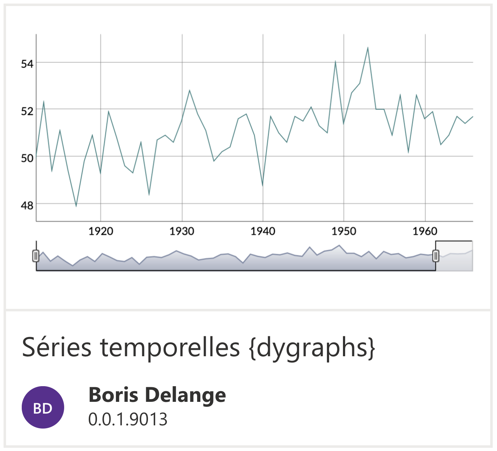

### <i class="fa fa-cogs" style="color: brackets-curly;"></i> Introduction

Dans ce tutorial, nous allons apprendre à **créer un plugin** au sein de l'application.

 

Un plugin est un **script** composé de code écrit avec la librairie **Shiny** en R, permettant d'**ajouter des fonctionnalités** à l'application.

Par exemple, le plugin 'Séries temporelles {dygraphs}' que l'on voit ci-dessus permettra aux utilisateurs d'afficher les données de leurs patients sous forme de **séries temporelles**, à l'aide de la librairie R <a href="https://rstudio.github.io/dygraphs/" target="_blank">{dygraphs}</a>.

Un plugin est composé de **trois parties** :

- **Interface utilisateur** (user interface - UI) : il s'agit du *front-end*, vous développez ici l'interface graphique que verre l'utilisateur
- **Server** : il s'agit du *backend*, vous développez ici la logique du plugin, la manipulation des données etc
- **Traductions** : il s'agit d'un fichier CSV qui comprendra les traductions de l'interface utilisateur

Nous allons pas à pas développer un plugin permettant ___.

### UI - Interface utilisateur

### Server - backend

### Traductions

### Partageons notre plugin !
