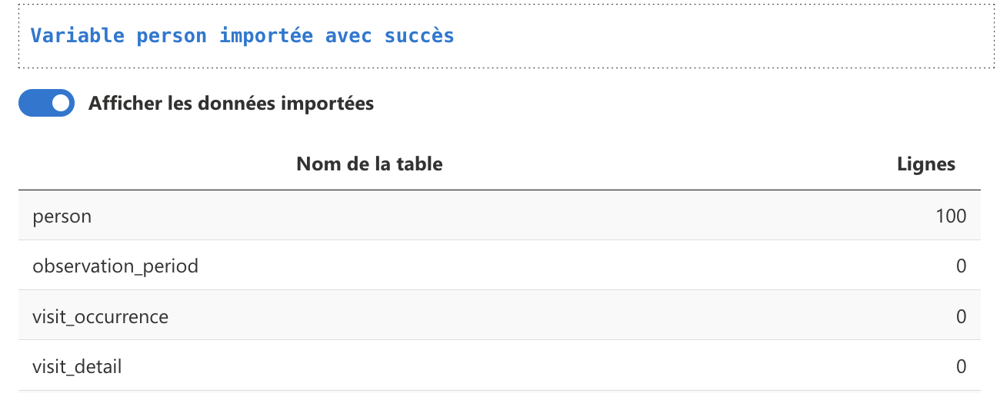
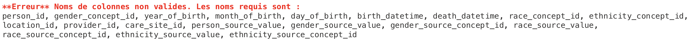

### <i class="fa fa-info-circle" style="color:steelblue;"></i> Introduction

Dans ce tutorial, nous allons voir comment **importer des données** dans l'application.

Nous verrons d'abord comment **créer un set de données** dans LinkR, puis nous **importerons un premier set de donneés**.

Nous **testerons** nos données en **créant une étude**.

Nous importerons ensuite un plus grand set de données au format OMOP, en utilisant les données de la base **MIMIC-IV**.

Nous finirons en **partageant** notre code via notre dépôt git.

**Plan** :

- Entrepôts de données de santé et modèles de données
- Créer un set de données
- Créer des données au format OMOP
- Importer les données dans LinkR
- Avec un peu plus de tables
- Test avec les données MIMIC-IV
- Afficher nos données
- Partageons notre code

 

  
Créer un set de données

### <i class="fa fa-database" style="color:steelblue;"></i> Entrepôts de données de santé et modèles de données

Pour savoir ce qu'est un entrepôt de données de santé, lisez le tutoriel ***Entrepôts de données de santé et collecte des données médicales*** dans la rubrique *Données de santé* de la page *Ressources*.

Lisez également le tutoriel ***Modèles de données***, également dans la rubrique *Données de santé* de la page *Ressources*.

Le modèle de données utilisé par LinkR est le modèle **<a href = "https://ohdsi.github.io/CommonDataModel/" target = "_blank">OMOP</a>**.

 
### <i class="fa fa-table" style="color:steelblue;"></i> Créer un set de données

Pour commencer, rendez-vous sur la page ***Set de données***, depuis la page des *Paramètres* en haut à droite de la page.

 

Allez ensuite dans l'onglet ***Gestion des sets***, puis créez un nouveau set, que vous appellerez par exemple 'Set de données tutoriel'.

Une fois le set de données créé, vous devriez le voir apparaître dans le tableau au milieu de la page.

Sur la ligne correspondant à votre nouveau set de données, cliquez sur l'icône de rouages afin d'**accéder aux options** de votre set.

Choisissez la **version OMOP 6.0** dans le menu déroulant correspondant.

Pour **en savoir plus sur les options**, cliquez sur le point d'interrogation en haut à droite de la page, puis sur *Options du set*. Il existe **une page d'aide pour chaque onglet**.

 

Nous allons maintenant pouvoir **éditer le code** de notre set de données. Rendez-vous pour cela dans l'onglet *Editer le code*.

L'éditeur auquel vous avez accès fonctionne comme une **console R**, exécutez le code en cliquant sur 'Exécuter' ou en utilisant les raccourcis :

- CMD/CTRL + SHIFT + ENTER : exécute l'ensemble du code
- CMD/CTRL + ENTER : exécute le code sélectionné
- CMD/CTRL + SHIFT + C : commente le code sélectionné

Pensez à sauvegarder votre code. Vous pouvez également utiliser le raccourci CMD/CTRL + S.

 

  
Importer des données

### <i class="fa fa-table" style="color:steelblue;"></i> Créer des données au format OMOP

Pour commencer, nous allons créer des **données factices** au **format OMOP**, nous verrons ensuite comment des données réelles via la base de données MIMIC-IV.

Créons une fonction *person*, qui contiendra les **données de 100 patients**.

<pre><code class = "r code_highlight" style = "font-size:12px;">person <- function(){
  tibble::tibble(
    person_id = 1:100,
    gender_concept_id = sample(c(8507L, 8532L), 100, replace = TRUE),
    year_of_birth = sample(1920:2010, 100, replace = TRUE),
    month_of_birth = sample(1:12, 100, replace = TRUE),
    day_of_birth = sample(1:28, 100, replace = TRUE),
    race_concept_id = NA_integer_,
    ethnicity_concept_id = NA_integer_,
    location_id = sample(1:10, 100, replace = TRUE),
    provider_id = sample(1:10, 100, replace = TRUE),
    care_site_id = sample(1:10, 100, replace = TRUE),
    person_source_value = paste("Source", 1:100),
    gender_source_value = NA_character_,
    gender_source_concept_id = NA_integer_,
    race_source_value = NA_character_,
    race_source_concept_id = NA_integer_,
    ethnicity_source_value = NA_character_,
    ethnicity_source_concept_id = NA_integer_
  ) %>%
  dplyr::mutate(
      birth_datetime = lubridate::ymd_hms(paste0(paste(year_of_birth, month_of_birth, day_of_birth, sep = "-"), " 00:00:00")),
      death_datetime = dplyr::case_when(runif(100) < 2/3 ~ as.POSIXct(NA), TRUE ~ birth_datetime + lubridate::years(sample(30:80, 100, replace = TRUE))),
      .after = "day_of_birth"
  )
}

person()
</code></pre>

Rendez-vous sur la page **Editer le code du set**, puis **copiez-y le code** ci-dessus.

En **exécutant** ce code, vous devriez voir apparaître votre set de données de 100 patients en bas de l'écran.

Pour plus d'informations sur la **structure** de la **base de données OMOP**, rendez-vous dans la **page d'aide** ***Modèles de données*** via le point d'interrogation en haut de l'écran. Vous y trouverez un lien vers le <a href = "https://ohdsi.github.io/CommonDataModel/" target = "_blank">site d'OHDSI, détaillant le modèle OMOP</a>.

Regardez la structure de la table *Person*, vous retrouvez bien les colonnes que nous avons créées pour notre variable *person*.

Attention, les **colonnes** et les **tables** peuvent **changer** en fonction des **versions** d'OMOP.

Par exemple, le version 5.3 ne comprend par la colonne *death_datetime* dans la table *Person*, elle a à la place une table *Death*.

Vous pouvez choisir la version via le menu déroulant en haut de la page présentée ci-dessus.

Voilà **nos données prêtes**, nous allons pouvoir les **importer** dans LinkR.

 
### <i class="fa fa-upload" style="color:steelblue;"></i> Importer les données dans LinkR

Pour importer des données dans LinkR, nous allons utiliser la fonction <a href = "https://interhop.frama.io/linkr/linkr/reference/import_dataset.html" target = "_blank">***import_dataset***</a>.

Consultez également la **documentation depuis l'application**, via le point d'interrogation.

La fonction *import_dataset* comprend les arguments suivants :

- *output, ns, i18n, r, d* : qui sont les variables permettant le fonctionnement de l'application
- *dataset_id* : où vous indiquez **l'ID du dataset** actuel, via la balise *%dataset_id%*
- *data* : où vous indiquez la **fonction qui chargera les données** pour une variable (exemple : *person()* de notre code ci-dessus)
- *omop_table* : où vous indiquez la **variable que vous souhaitez importer** (*person*, *measurement*...)
- *omop_version* : où vous indiquez la **version utilisée** du modèle de données OMOP. Utilisez la balise *%omop_version%* qui prendra la version configurée dans les options du set de données.
- *read_with* : indiquez avec quelle **librairie R** vous voulez **lire les données** importées
- *save_as* : indiquez sous quel **format** vous voulez enregistrer les données après les avoir importées
- *rewrite* : indiquez si vous souhaitez **écraser** l'ancien fichier de données pour le remplacer par le nouveau
- *allow_numeric_instead_integer* : indiquez si vous autorisez que les colonnes au format numérique puissent être laissées telles quelles plutôt que converties au format integer
- *allow_dttm_instead_date* : indiquez si vous autorisez que les colonnes au format datetime puissent être laissées telles quelles plutôt que converties au format date

Voici le code qui nous permettra d'importer nos données.

<pre><code class = "r code_highlight" style = "font-size:12px;">import_dataset(
    dataset_id = %dataset_id%, # Cette balise sera remplacée par la valeur du set de données actuellement sélectionné
    data = person(), # En appelant notre fonction person(), nous obtiendrons les données que nous avons créées
    omop_table = "person", # Le nom de la table OMOP que nous souhaitons importer
    omop_version = %omop_version%, # Cette balise sera remplacée par la valeur de la version OMOP du set de données actuellement sélectionné
    output = output, ns = ns, i18n = i18n, r = r, d = d
)
</code></pre>

Vous devriez voir apparaître un message vous indiquant que vos données ont bien été importées.

Si vous cochez 'Afficher les données importées' en dessous de l'éditeur de code, vous verrez **combien de lignes** sont **importées** par table OMOP.

Nous voyons que nous avons bien **importé 100 lignes** dans la table person.

A chaque fois que vous chargerez un set de données depuis la page 'Données', c'est ce **code** qui sera **exécuté**.

On comprend alors l'intérêt d'**utiliser une fonction** pour charger nos données : les données ne seront chargées **que si la fonction est appelée**.

Si j'ai utilisé l'argument *save_as*, par exemple avec la valeur 'csv', mes données seront enregistrées au format CSV si le fichier n'existe pas déjà.

La fonction *person()* ne sera appelée que la première fois : elle ne sera plus appelée si le fichier CSV correspondant à notre table (*person.csv*) existe.

Si les données que j'importe ont changé entre-temps, je peux toujours **remplacer le fichier** CSV en mettant l'argument *rewrite* à 'TRUE'.

Voici un exemple.

<pre><code class = "r code_highlight" style = "font-size:12px;">import_dataset(
    dataset_id = %dataset_id%,
    data = person(),
    omop_table = "person",
    omop_version = %omop_version%,
    save_as = "csv", # Les données contenues dans la fonction person() seront sauvegardées au format CSV
    read_with = "vroom", # Les données enregistrées en CSV seront lues avec la librairie vroom
    rewrite = FALSE, # Si le fichier person.csv existe dans le dossier de notre set de données, le fichier existant sera conservé
    output = output, ns = ns, i18n = i18n, r = r, d = d
)
</code></pre>

Si maintenant les données contenues dans la fonction *person()* changent, par exemple parce qu'il s'agit d'une connexion à une base de données avec des données mises à jour régulièrement, je peux vouloir remplacer la fichier *person.csv* existant.

Je mettrai l'argument *rewrite* à TRUE pour remplacer le fichier, puis modifierai de nouveau l'argument *rewrite* pour FALSE, afin que la fonction chargeant les données ne soit pas chargée à chaque fois.

<pre><code class = "r code_highlight" style = "font-size:12px;">import_dataset(
    dataset_id = %dataset_id%,
    data = person(),
    omop_table = "person",
    omop_version = %omop_version%,
    save_as = "csv",
    read_with = "vroom",
    rewrite = TRUE, # Je modifie cet argument juste une fois, le temps que le fichier CSV soit remplacé avec mes nouvelles données
    output = output, ns = ns, i18n = i18n, r = r, d = d
)
</code></pre>

Voyons maintenant les **différentes façons** d'**importer des données** dans LinkR.

La fonction qui charge nos données doit charger les données sous forme :

- de data.frame
- de tibble
- de lazy tibble, dans le cas d'une connexion à une base de données

Je décide alors si je veux **sauvegarder ces données**, et si oui avec **quel format**.

L'argument *save_as* peut prendre les valeurs suivantes : 'none' (par défaut), 'csv' et 'parquet'.

Je décide ensuite avec **quelle librairie** je veux **lire ces données**, avec l'argument *read_with*.

*read_width* peut prendre les valeurs suivantes : 'none', 'vroom', 'duckdb', 'spark', 'arrow'.

Toutes les **associations** entre *save_as* et *read_width* ne sont pas possibles.

Voici les associations possibles (*read_with* et *save_as*) :

- vroom / csv
- arrow / parquet
- duckdb / csv
- duckdb / parquet
- duckdb / none
- spark / csv
- spark / parquet
- spark / none

L'avantage du format *parquet* est que c'est un **format de stockage optimisé** pour les **hauts volumes** de données.

Utiliser *duckdb* permet de ne **pas charger toutes les données en mémoire**, les données ne seront chargées qu'au moment de la "collecte".

Nous pouvons ainsi filtrer nos données sans charger les tables entières, ce qui **optimise les performances**.

En pratique :

- **chargez des données** à partir de **bases de données** autant que possible : ceci permet de charger le moins possible les données en mémoire, les performances seront optimisées
- si vous avez besoin de **stocker les données** localement, par exemple si vous devez faire des modifications des données après les avoir chargées depuis une base de données, utilisez le stockage par ***parquet*** et la lecture par ***duckdb***
- si vous avez besoin de **réaliser du calcul distribué** sur **plusieurs serveurs**, utilisez la lecture par ***spark***, avec une connexion à une base de données (argument 'none' pour read_with)

 
### <i class="fa fa-database" style="color:steelblue;"></i> Test avec les données MIMIC-IV

Nous allons maintenant charger des données depuis la **base de données <a href = "https://mimic.mit.edu/" target = "_blank">MIMIC-IV</a>**.

Il s'agit d'une base de données des services de soins intensifs du BIDMC (Beth Israel Deaconess Medical Center).

Nous avons accès publiquement aux **données de 100 patients** via <a href = "https://www.physionet.org/files/mimic-iv-demo-omop/0.9/1_omop_data_csv/" target = "_blank">ce lien</a>.

Nous allons **importer** quelques-unes de ces tables puis **tester nos données** en **créant une étude** au sein de l'application.

Commençons avec la table ***person***.

<pre><code class = "r code_highlight" style = "font-size:12px;">
person <- function(){
  # Chargement de la table person.csv depuis le site physionet.org
  vroom::vroom("https://www.physionet.org/files/mimic-iv-demo-omop/0.9/1_omop_data_csv/person.csv", progress = FALSE) %>%
    dplyr::mutate(person_id = 1:dplyr::n()) # Les index de person_id n'étant pas adéquats, nous les réindexons de 1 à 100
}

import_dataset(
    dataset_id = %dataset_id%,
    data = person(),
    omop_table = "person",
    omop_version = %omop_version%,
    output = output, ns = ns, i18n = i18n, r = r, d = d
)
</pre></code>

Si vous exécutez ce code depuis le même set de données que nous avons créé au début du tutoriel, vous devriez avoir ce message d'erreur :

Ceci est dû au fait que les colonnes de notre table *person* ne correspondent pas avec la version OMOP sélectionée.

Allez dans les options, **changez la version OMOP** pour 5.3, pensez à **sauvegarder** les options puis **exécutez** de nouveau le **code**.

Vous devriez avoir un nouveau message d'erreur, vous indiquant que la colonne *ethnicity_source_concept_id* doit être de type integer.

En effet, cette colonne a été chargée au format *numeric*, étant donné que l'on n'a pas précisé à la fonction *vroom* quels étaient les types de colonnes attendus (ce que l'on peut faire avec l'argument *col_types*).

Deux solutions :

- soit nous changeons la colonne pour la transformer en *integer*
- soit nous acceptons de charger des colonnes au format *numeric* plutôt qu'*integer* avec l'argument *allow_numeric_instead_integer*

Pourquoi accepter le format *numeric* plutôt qu'*integer* ?

Parfois, en chargeant des données depuis une base de données, il est impossible de transformer les types de colonnes, en fonction de la librairie utilisée pour la connexion à la base de données.

Pour notre exemple, il est plus simple de préciser le type de colonne attendu pour chaque colonne.

<pre><code class = "r code_highlight" style = "font-size:12px;">person <- function(){
    # Utilisation de l'argument col_types en précisant le type de colonne attendu
    vroom::vroom("https://www.physionet.org/files/mimic-iv-demo-omop/0.9/1_omop_data_csv/person.csv", col_types = "niiiiTiiiiiccicici", progress = FALSE) %>%
        dplyr::mutate(person_id = 1:dplyr::n())
}

import_dataset(
    dataset_id = %dataset_id%,
    data = person(),
    omop_table = "person",
    omop_version = %omop_version%,
    output = output, ns = ns, i18n = i18n, r = r, d = d
)
</pre></code>

Le chargement devrait se faire correctement.

Chargeons maintenant les autres tables.

 

  
Tester notre set

### <i class="fa fa-eye" style="color:steelblue;"></i> Afficher nos données

Créer une étude ...

 

  
Partager notre code

### <i class="fa fa-share-alt" style="color:steelblue;"></i> Partageons notre code
