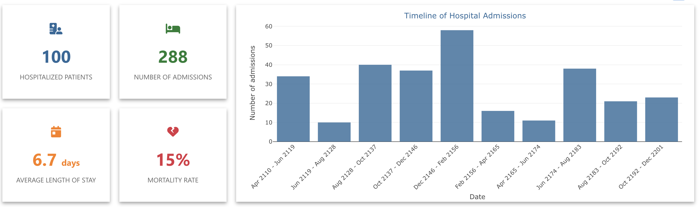

# Hospital Indicators Plugin

## Introduction

This plugin provides automatic visualization and analysis of key hospital activity indicators from OMOP CDM data. It offers an intuitive interface to quickly generate essential statistics about your patient population: patient count, average length of stay, demographic distribution, mortality, and more.

  

## Key Features

### 1. No-Code User Interface

The plugin provides a comprehensive graphical interface to configure your indicators without writing a single line of code:

- **Indicator Selection**: Choose from a list of predefined indicators
- **Analysis Scope**: Analyze the entire hospitalization or specific units
- **Customization**: Adjust legends and titles to your needs
- **Automatic Updates**: Results refresh automatically when the patient group changes

### 2. Available Indicators

#### Patient Count
Displays the total number of unique patients in the selected cohort. Ideal for quickly understanding your study population size.

#### Admission Count
Counts the total number of hospital stays, allowing identification of patients with multiple hospitalizations.

#### Admission Timeline
Visualizes the temporal distribution of admissions as a histogram. Helps identify trends and activity peaks.

#### Average Age
Calculates and displays the average patient age with detailed statistics (min, max, quartiles) on hover. Age is calculated at admission date, prioritizing precise birth date when available.

#### Gender Distribution
Presents the male/female distribution of your population as a pie chart with percentages and counts.

#### Mortality Rate
Calculates the percentage of deceased patients in the selected cohort, with absolute number on hover.

#### Average Length of Stay
Displays the average hospitalization duration in days, with the option to visualize the complete distribution as a histogram.

## Configuration and Settings

### Analysis Scope

The plugin allows two analysis modes:

1. **Complete Hospitalization**: Analyzes all hospital stays in your cohort
2. **Hospital Units**: Focus on specific departments (ICU, cardiology, etc.)

When selecting "Hospital Units" mode, a multi-select dropdown appears, allowing you to choose one or more departments. Buttons allow quick selection/deselection of all units.

### Display Customization

Each indicator can be customized:
- **Legends**: Two text fields allow adaptation of labels displayed under indicators
- **Chart Titles**: For visualizations (timeline, distribution), customize the title
- **Axes**: Define X and Y axis labels for temporal charts
- **Number of Bins**: Adjust histogram granularity (5 to 100 bins)

### Automatic Updates

The "Automatic Updates" option (enabled by default) automatically recalculates indicators when:
- Selected patient group changes
- Analysis period is modified
- Source data is updated

Disable this option if you want to manually control recalculation timing via the "Display Result" button.

## Configuration Management

### Save and Load

The plugin allows saving your analysis configurations for later reuse:

1. **Save**: Click "Save Settings and Code" to save the current configuration
2. **Configuration Name**: Assign a descriptive name (e.g., "Monthly ICU Analysis")
3. **Load**: Select a saved configuration from the dropdown to restore it

Configurations save:
- Indicator choice and scope
- Selected units
- All customizations (texts, titles, parameters)
- Corresponding generated R code

### User Sharing

Configurations are linked to the widget and can be shared between users with access to the same project, facilitating collaboration and standardization of analyses.

## Advanced Mode: Code Editing

### Automatic Code Generation

Like all LinkR plugins, this plugin automatically generates R code corresponding to your interface selections. This code is:
- **Transparent**: Visible in the "Code" tab to understand performed calculations
- **Editable**: Advanced users can customize the generated code
- **Reusable**: Can be copied to create custom analyses

### Interface ↔ Code Workflow

The plugin operates on a bidirectional principle:

1. **Interface → Code**: Your interface selections automatically generate R code
2. **Execution**: This code is executed to produce visual results
3. **Customization**: Data scientists can modify code for specific analyses
4. **Unified Save**: Saving preserves both interface parameters AND code
