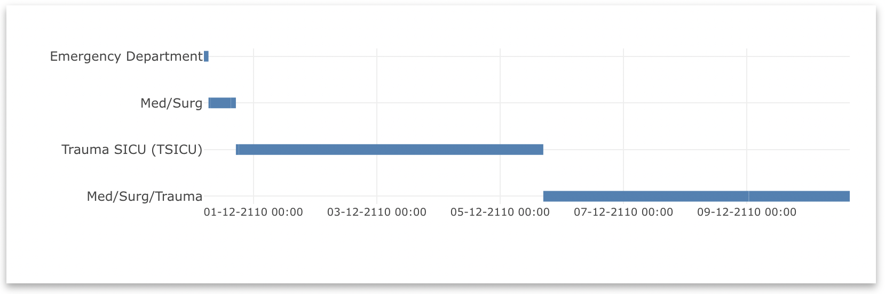

# Hospital Stays Plugin

## Description

Visualize patient hospital stays across different care units in an interactive timeline format. This plugin helps healthcare professionals track patient care pathways and analyze hospitalization patterns.

  

## How to Use

1. **Select a patient** using LinkR's patient selection interface
2. The timeline will automatically display all hospital stays for that patient
3. **Hover over timeline segments** to see detailed information about each stay

*Screenshot of patient selection and timeline interaction*

## What You See

### Timeline Display
- **Horizontal timeline**: Shows the chronological sequence of hospital stays
- **Care units**: Each hospital department appears as a separate row
- **Stay duration**: Length of each segment represents stay duration
- **Hover details**: Unit name, start date, end date

*Screenshot of timeline with hover information*

## Clinical Applications

### Care Pathway Analysis
- Track patient movement between departments
- Identify care coordination patterns
- Analyze readmission patterns

### Quality Improvement
- Study length of stay variations
- Examine care transitions
- Identify utilization patterns

*Screenshot showing care pathway example*

## Configuration

### Settings
- **Automatic Updates**: Enable to refresh timeline when selecting different patients
- **Manual Mode**: Disable for manual refresh control

*Screenshot of configuration panel*

### Save Configurations
Save different analysis setups for:
- Routine patient reviews
- Research protocols
- Team workflows

*Screenshot of configuration management*

## Data Requirements

- **Patient Selection**: Must select a patient first
- **OMOP Data**: Requires visit_detail and care_site tables
- **Permissions**: Appropriate access to patient-level data

## Error Messages

**"No patient selected"**: Select a patient to view hospital stays
**"No data available"**: Selected patient has no recorded hospital stays

*Screenshot of error messages*

## Advanced Features

### Code Editor
For advanced users: modify the generated R code to customize analyses or add filters.

*Screenshot of code editor*

The Hospital Stays plugin provides a clear, visual way to understand patient care journeys through hospital systems.

